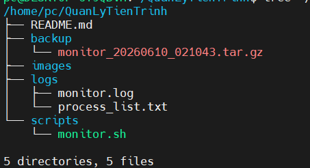

# Bài tập Linux - Quản lý tiến trình & Shell Script

## Thông tin

- Môn học: Linux
- Chủ đề: Quản lý tiến trình và Shell Script
- Sinh viên: Phạm Ngọc Tú

---

## Cấu trúc thư mục

```text
QuanLyTienTrinh
├── backup
├── logs
├── scripts
│   └── monitor.sh
├── images
└── README.md
```

## Chức năng của monitor.sh

1. Xem danh sách tiến trình sleep
2. Ghi log tiến trình
3. Dừng tất cả tiến trình sleep
4. Sao lưu file log
5. Thoát chương trình

---

## Một số lệnh đã sử dụng

### Tạo tiến trình nền

```bash
sleep 100 &
sleep 200 &
sleep 300 &
```

### Xem tiến trình

```bash
ps -ef | grep sleep
```

### Kết thúc tiến trình

```bash
kill PID
```

### Chạy script

```bash
./monitor.sh
```

---


### Tạo cấu trúc thư mục




## Kết quả

- Quản lý được tiến trình nền.
- Ghi log tiến trình.
- Dừng tiến trình theo yêu cầu.
- Sao lưu log bằng file nén.
- Đẩy source code lên GitHub thành công.
